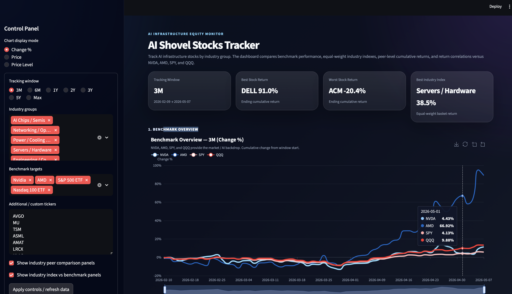

# AI Shovel Stocks Tracker

A Streamlit + ECharts dashboard for tracking AI infrastructure, or "AI shovel," stocks by industry group.

The dashboard is designed for long-term monitoring of companies that support the AI compute buildout beyond just GPU makers. It compares benchmarks, industry indexes, peer stocks, and return correlations in a clean dark dashboard layout.

---
# AI Shovel Dashboard

A dashboard tracking AI infrastructure and “shovel” companies.

## Live Demo

- Streamlit App: [YOUR_STREAMLIT_LINK_HERE](https://aishoveldashboard-ap8nqebdanjxccfqddfyud.streamlit.app/)
- Static Page: https://kelly-chen-818.github.io/ai_shovel_dashboard/
## Screenshot



--

## Key Idea

AI investing is not only about model companies or GPU chips. The AI infrastructure cycle also depends on:

- Semiconductors and ASICs
- Networking and optical components
- Power, cooling, and electrical infrastructure
- Data centers and REITs
- AI servers and hardware
- Engineering and construction
- Storage and memory
- Software, security, and data infrastructure

This dashboard treats those groups as trackable baskets. It lets you compare:

1. **Benchmarks**: NVDA, AMD, SPY, QQQ  
2. **Industry indexes**: equal-weight baskets by AI infrastructure category  
3. **Peer stocks**: individual companies within each industry group  
4. **Correlation structure**: which names move most like NVDA, AMD, SPY, or QQQ  

---

## Dashboard Summary

The dashboard has five major sections:

### 1. Benchmark Overview

Shows cumulative returns for:

- NVDA
- AMD
- SPY
- QQQ

This provides the market and AI-theme backdrop.

### 2. Industry Index Overview vs Benchmarks

Creates an equal-weight return index for each industry group and compares all indexes against the four benchmarks.

This answers:

> Which AI infrastructure sectors are outperforming or lagging the core AI benchmarks?

### 3. Industry Index vs Four Benchmarks

For each industry, the dashboard shows:

- The industry equal-weight index
- NVDA
- AMD
- SPY
- QQQ

This gives a clean sector-level comparison without overcrowding the chart.

### 4. Industry Peer Comparison

Each industry gets its own chart showing only companies in that group.

This avoids the problem of putting 30+ stocks into one unreadable time-series chart.

### 5. Correlation Heatmap and Tables

The dashboard calculates daily-return correlations versus:

- NVDA
- AMD
- SPY
- QQQ

This helps identify which stocks behave more like AI beta, broader tech beta, or general market beta.

---

## Features

- Adjustable tracking window:
  - 3M
  - 6M
  - 1Y
  - 2Y
  - 3Y
  - 5Y
  - Max

- Dark professional dashboard style
- Interactive ECharts:
  - Hover tooltips
  - Legend toggles
  - Zoom slider
  - Save chart image
- User-editable ticker universe
- User-selectable industry groups
- Equal-weight industry indexes
- Benchmark comparison
- Peer comparison by industry
- Correlation heatmap
- Correlation table
- Price data export
- Industry index data export

---

## Installation

```bash
pip install streamlit yfinance pandas numpy streamlit-echarts
```

---

## Run

```bash
streamlit run ai_shovel_stocks_tracker.py
```

---

## Methodology

### Price Data

The dashboard uses `yfinance` and adjusted close prices:

```python
yf.download(..., auto_adjust=True)
```

### Daily Return

```python
daily_returns = prices.pct_change()
```

### Cumulative Return

```python
cumulative_returns = (1 + daily_returns).cumprod() - 1
```

### Industry Index

Each industry index is calculated as an equal-weight average of available member daily returns:

```python
industry_return = daily_returns[group_tickers].mean(axis=1)
industry_index = (1 + industry_return).cumprod() - 1
```

This is intentionally simple and transparent.

### Correlation

Correlation is based on daily returns:

```python
corr = daily_returns.corr()
```

---

## Default Industry Groups

### AI Chips / Semis

- AVGO
- MU
- TSM
- ASML
- AMAT
- LRCX
- KLAC

### Networking / Optical

- ANET
- CSCO
- APH
- COHR
- LITE

### Power / Cooling / Electrical

- VRT
- ETN
- GEV
- JCI
- CARR
- MOD

### Data Center / REIT

- EQIX
- DLR
- AMT

### Servers / Hardware

- SMCI
- DELL
- HPE

### Engineering / Construction

- PWR
- EME
- ACM
- FIX
- J
- FLR

### Storage / Memory

- MU
- WDC
- STX
- NTAP
- PSTG

### Software / Security

- PLTR
- PANW
- NOW
- NET
- CRWD
- ZS
- OKTA

---

## Recommended Use

Use the dashboard as a monitoring layer:

- **3M**: short-term momentum and risk-on/risk-off rotation
- **6M / 1Y**: medium-term theme rotation
- **2Y**: AI infrastructure cycle view
- **3Y / 5Y**: long-term structural trend
- **Max**: long-horizon context

---

## Notes

This dashboard is for research and monitoring only. It is not investment advice.

P/E, valuation, financial statements, and fundamental data are not included in this version. They can be added as a later module.
